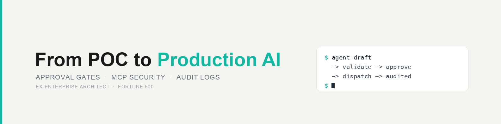

# Hey, I'm René

Solution Architect and AI Engineer. 6 years in architecture roles at Fortune 500, now building production AI systems.

**What I build:**
- AI agent infrastructure: orchestration, HITL approval workflows, monitoring, semantic search
- Enterprise architecture: capability mapping, API strategy, integration design
- Cloud and DevOps: Kubernetes, Linux, systemd services, CI/CD

**What I work with:** Go, TypeScript, LLM APIs, vector databases, cron orchestration

   

**Open source contributions:**

| Project | PR | What |
|---|---|---|
| [Tencent/WeKnora](https://github.com/Tencent/WeKnora) | [#835](https://github.com/Tencent/WeKnora/pull/835)  | Parallel tool calling support |
| [steveyegge/beads](https://github.com/steveyegge/beads) | [#2884](https://github.com/gastownhall/beads/pull/2884)  | Multi-project support, Notion sync, backup/restore |
| [e2b-dev/infra](https://github.com/e2b-dev/infra) | [#2273](https://github.com/e2b-dev/infra/pull/2273)  | Local dev docs: prerequisites, verification steps, troubleshooting |
| [pacifio/cersei](https://github.com/pacifio/cersei) | [#10](https://github.com/pacifio/cersei/pull/10)  | Native Google Gemini provider + Cohere & SambaNova support |

[All merged PRs](https://github.com/pulls?q=is%3Apr+author%3Arenezander030+is%3Amerged+archived%3Afalse)

**Website:** [renezander.com](https://renezander.com)
