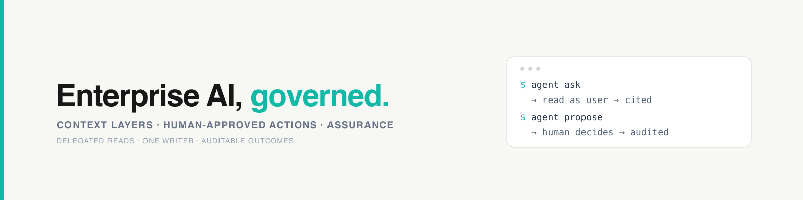

# Hey, I'm René

**Enterprise AI Architect** — production context layers, governed agent workflows, and EU-ready AI systems.

I build the parts that decide whether an agent survives contact with a real company: where its context comes from, what it is allowed to do, and how you prove afterwards that it behaved. Deterministic-first, human-approved, self-hostable — no data leaving your VPC unless you decided it should.

   

> **New:** merged into **[tetherto/qvac](https://github.com/tetherto/qvac)** — the official repo of Tether's QVAC AI platform: [#3729 · validate RAG queries before logging](https://github.com/tetherto/qvac/pull/3729)  (Aug 2026) · [all contributions ↓](#open-source-contributions)

## The architecture

Three layers. Each repo stands on its own; together they are one path from *what the agent knows* to *what it did and why*.

### Context Layer — where the facts come from, and whether you can trust them

- **[agentic-task-system](https://github.com/renezander030/agentic-task-system)**  — CLI + MCP that turns the systems you already run (TickTick, Notion, GitHub, Obsidian, Airtable, Google Tasks) into agent context. Hybrid RRF retrieval, provenance on every result, reviewed writes, undo. The real systems stay the source of truth.
- **[graphiti-local](https://github.com/renezander030/graphiti-local)**  — local-first temporal knowledge graph: six read-only MCP retrieval tools, a `kg` CLI, human-gated fact ingestion. Built on Graphiti, runs on your own hardware. Answers *"what was true at the time?"*, not just *"what is true now?"*

### Execution Layer — what the agent is allowed to do

- **[draftcat](https://github.com/renezander030/draftcat)**  — governed AI pipelines for service businesses: deterministic-first, operator-approved, single Go binary (MIT). Tool-call gates, HITL, audit trail.
- **[agent-approval-gate](https://github.com/renezander030/agent-approval-gate)** — the `draft → validate → approve → dispatch → audit` pattern with JSON schemas, an n8n workflow, and an email-approval example.

### Assurance Layer — how you prove it still works next quarter

- **[processbench](https://github.com/renezander030/processbench)**  — business-specific benchmark packs for repeatable workflow regression checks. Swap a model, measure what actually moved.
- **[skillgate](https://github.com/renezander030/skillgate)**  — deterministic finish-line gates for AI coding agents: a model-independent evaluator that blocks commit/publish until your definition-of-done passes. opencode, Claude Code, pre-commit, CI.

**Enterprise integration:** Azure, Microsoft Teams, Jira, Confluence, HubSpot, LeanIX — from delivery work in regulated environments, not from demos.

## The series

**Production AI Automation Notes** — a running set of repos and gists on:
- approval gates for AI agents
- MCP server security (permissions, tenants, audit logs)
- Claude Code policies for company repos
- n8n workflows with human approval
- audit-log schemas

Follow if you're building agents that need to work outside demos.

## Recent gists

| [Vector dimension mismatch, expected 1024 but got 768: the silent embedding-width bug in Graphiti + FalkorDB](https://gist.github.com/renezander030/c0a62739bbe114a2fc5b3cab4d7d307c) | Vector dimension mismatch expected 1024 but got 768 / graphiti EMBEDDING_DIM read at import time / client-side truncating slice / nomic-embed-text 768 vs text-embedding-3-small 1536 / FalkorDB vec.cosineDistance / silent embedding corruption / kg doctor preflight (September 2026) |
| [Never let an agent write to the knowledge graph: queued proposals, one writer, and refusals that exit non-zero (PAAN #18)](https://gist.github.com/renezander030/a3600b3378b01f00080f9f41150f16d2) | add_episode cross-group data contamination / graphiti shared self.driver mutation race / agent write gate / propose approve drain / a refusal that exits 0 is not a refusal / single writer / read-only MCP tools (September 2026) |
| [Validate before you log: the RAG query guard that belongs above your first log line (PAAN #17)](https://gist.github.com/renezander030/34d7197e2d9f83d986766742ab979d04) | RAG query validation / TypeError Cannot read properties of null reading 'substring' / validate before logging / log-ordering test / whitespace-only query / log injection / zod guard / capped log preview (August 2026) |
| [GPT-5 / o-series vision calls failing in Go: MaxCompletionTokens and the empty finish_reason=length response](https://gist.github.com/renezander030/15f07a6a9e4cf5780f611eeeead5f6da) | gpt-5 vision empty response / this model is not supported MaxTokens please use MaxCompletionTokens / finish_reason length / go-openai ReasoningValidator / o-series temperature beta-limitations / reasoning tokens / max_completion_tokens (August 2026) |
| [Retrieval that degrades instead of failing: keyword fallback when the embedder dies (PAAN #16)](https://gist.github.com/renezander030/77b1e95ae3a7b4460db0714b7dcf35d6) | agent memory degraded retrieval / Premature close / APIConnectionError / embedding provider down / keyword fallback / reciprocal rank fusion / RRF / per-source status / no vector database (August 2026) |

[All gists →](https://gist.github.com/renezander030)

## Open source contributions

| Project | PR | What |
|---|---|---|
| [tetherto/qvac](https://github.com/tetherto/qvac) | [#3729](https://github.com/tetherto/qvac/pull/3729)  | Validate RAG queries before logging them |
| [Tencent/WeKnora](https://github.com/Tencent/WeKnora) | [#2614](https://github.com/Tencent/WeKnora/pull/2614)  | GPT-5 / o-series vision model support (max_completion_tokens) |
| [Tencent/WeKnora](https://github.com/Tencent/WeKnora) | [#835](https://github.com/Tencent/WeKnora/pull/835)  | Parallel tool calling support |
| [steveyegge/beads](https://github.com/steveyegge/beads) | [#2884](https://github.com/gastownhall/beads/pull/2884)  | Multi-project support, Notion sync, backup/restore |
| [e2b-dev/infra](https://github.com/e2b-dev/infra) | [#2273](https://github.com/e2b-dev/infra/pull/2273)  | Local dev docs: prerequisites, verification steps, troubleshooting |
| [pacifio/cersei](https://github.com/pacifio/cersei) | [#10](https://github.com/pacifio/cersei/pull/10)  | Native Google Gemini provider + Cohere & SambaNova support |

[All merged PRs](https://github.com/pulls?q=is%3Apr+author%3Arenezander030+is%3Amerged+archived%3Afalse)

## Creator tooling

A separate track from the enterprise work — same engineering standard, different audience.

- **[capcut-cli](https://github.com/renezander030/capcut-cli)**  — independent CLI to edit CapCut / JianYing projects: subtitles, timing, speed, templates, cut long-form → shorts. No API; reads `draft_content.json` directly.
- **[browserground](https://github.com/renezander030/browserground)** — local UI-grounding specialist for hybrid AI agents: Qwen3-VL-2B LoRA, screenshot + target → strict JSON bbox. Drop-in for Claude Code, Codex, browser-use.

---

**Stack:** Python, Go, TypeScript, Node.js, Kubernetes, Linux, systemd, vector databases, temporal knowledge graphs, MCP, LLM APIs.

**Website:** [renezander.com](https://renezander.com) · **YouTube:** [@determa](https://www.youtube.com/@determa)

## Production AI Automation Notes

A gist series on production-grade patterns for AI pipelines. Each entry covers one pattern with copy-pasteable code.

| # | Topic | Pattern |
|---|---|---|
| [#1](https://gist.github.com/renezander030/9069db775e494ffd2cdd5a09adf83add) | Agent Approval Gates | Schema-validated proposals, human review, deterministic dispatch |
| [#2](https://gist.github.com/renezander030/a7d99ad94b97f7943a9a04016d62faaa) | Token Budgets | Per-step, per-pipeline, per-day enforcement |
| [#3](https://gist.github.com/renezander030/c7bd6d5c4088e24d3add043720284453) | Agentic Knowledge Base | Karpathy-style LLM wiki with pluggable adapters |
| [#4](https://gist.github.com/renezander030/866bd85789c5902471f8f5fc86d09342) | CapCut / JianYing from an LLM agent | Deterministic JSON command boundary |
| [#5](https://gist.github.com/renezander030/8a23e32cde0c882a5aa069c4bfdf697f) | SQLite Dedup + Crash Safety | WAL mode, seen_items, audit log |
| [#6](https://gist.github.com/renezander030/213ffdf1ab1bdb169881927bc7080270) | Prompt-Injection Defense | Input sanitization, schema validation |
| [#7](https://gist.github.com/renezander030/7780cbc0b3ad4e802e8fba8bfc1c3a66) | PDF Cite Verification | Auditable LLM extraction with per-fragment bounding boxes |
| [#8](https://gist.github.com/renezander030/807559488f523892fc25870bf9501d29) | Stateless JSONL Queue Runner | One job per line in, one result per line out; no daemon, no open port |
| [#10](https://gist.github.com/renezander030/2f0754a4babd185d22d8498d5dc04982) | Deterministic Step Pipelines | Fixed typed steps; the LLM never picks the next action |
| [#11](https://gist.github.com/renezander030/a058fc0d5e7e7fa209d30cfa48e82ebb) | Pipeline Fixture Testing | Dry-run pipelines from JSON fixtures; zero API calls, deterministic CI |
| [#12](https://gist.github.com/renezander030/a28f118dec07d275ccc825aa833aba92) | LLM Skills as YAML | Prompt + output_schema + role in versioned YAML; validated by a linter |
| [#13](https://gist.github.com/renezander030/26d46d4c7fb9ab1b43fe19bc5bad6d07) | Inbound Agent Webhook Auth | Constant-time bearer token, fail-closed on empty secret, async 202 dispatch |
| [#14](https://gist.github.com/renezander030/262d8b8c44b4cddf51b3b84c40f3f669) | Self-Improving Voice Agent | Human-approved prompt diffs; harvest > group > propose > 2 approval gates > git commit > staging smoke > auto-versioned publish |
| [#15](https://gist.github.com/renezander030/ad81c7a805a09a844983f881e2c487e5) | AI Action Audit Trail | Append-only `action_approvals` table: who approved which payload, when; gate-violation query; GDPR Art. 22 provenance |
| [#16](https://gist.github.com/renezander030/77b1e95ae3a7b4460db0714b7dcf35d6) | Degraded Retrieval | Keyword fallback + RRF when the embedding provider dies; per-source status, `degraded: true` |
| [#17](https://gist.github.com/renezander030/34d7197e2d9f83d986766742ab979d04) | Validate Before You Log | Guard above the first log line; capped log preview; an ordering test that isn't vacuous |
| [#18](https://gist.github.com/renezander030/a3600b3378b01f00080f9f41150f16d2) | Gated Knowledge-Graph Writes | Agent may only queue a proposal; a human applies it; one writer; a refusal exits non-zero |

Reference implementation for entries #1, #2, #5, #6, #7, #9, #10, #11, #12, #13: [draftcat](https://github.com/renezander030/draftcat) (Go, MIT).

[All gists →](https://gist.github.com/renezander030)
